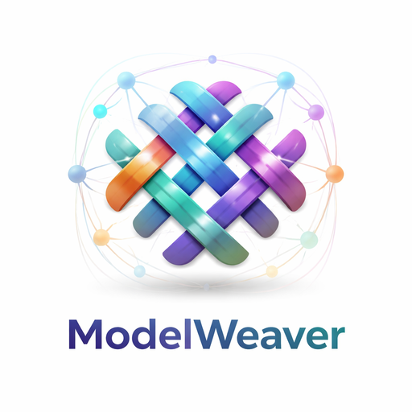

<p align="center">
  
</p>

# ModelWeaver

Multi-provider LLM proxy for Claude Code. Route different agent roles to different model providers with automatic fallback, racing, circuit breakers, and a native desktop GUI.

[](https://github.com/kianwoon/modelweaver/actions/workflows/ci.yml) [](https://github.com/kianwoon/modelweaver/actions/workflows/codeql.yml) [](https://github.com/kianwoon/modelweaver/actions/workflows/release.yml) [](https://opensource.org/licenses/Apache-2.0) [](https://www.npmjs.com/package/@kianwoon/modelweaver) [](https://github.com/kianwoon/modelweaver/stargazers)


## How It Works

ModelWeaver sits between Claude Code and upstream model providers as a local HTTP proxy. It inspects the `model` field in each Anthropic Messages API request and routes it to the best-fit provider.

```
Claude Code  ──→  ModelWeaver  ──→  Anthropic (primary)
                   (localhost)   ──→  OpenRouter (fallback)
                   │
              1. Match exact model name (modelRouting)
              2. Match tier via substring (tierPatterns)
              3. Fallback on 429 / 5xx errors
              4. Race remaining providers on 429
```

## Features

- **Tier-based routing** — route by model family (sonnet/opus/haiku) using substring pattern matching
- **Exact model routing** — route specific model names to dedicated providers (checked first)
- **Automatic fallback** — transparent failover on rate limits (429) and server errors (5xx)
- **Adaptive racing** — on 429, automatically races remaining providers simultaneously
- **Model name rewriting** — each provider in the chain can use a different model name
- **Weighted distribution** — spread traffic across providers by weight percentage
- **Circuit breaker** — per-provider circuit breaker with closed/open/half-open states, prevents hammering unhealthy providers
- **Request hedging** — sends multiple copies when a provider shows high latency variance (CV > 0.5), returns the fastest response
- **TTFB timeout** — fails slow providers before full timeout elapses (configurable per provider)
- **Stall detection** — detects stalled streams and aborts them, triggering fallback
- **Connection pooling** — per-provider undici Agent dispatcher with configurable pool size
- **Provider error tracking** — per-provider error counts with status code breakdown, displayed in GUI in real-time
- **Concurrent limits** — cap concurrent requests per provider
- **Interactive setup wizard** — guided configuration with API key validation, hedging config, and provider editing
- **Config hot-reload** — changes to config file are picked up automatically, no restart needed
- **Daemon mode** — background process with auto-restart, launchd integration, and reload support
- **Desktop GUI** — native Tauri app with real-time progress bars, provider health, error breakdown, and recent request history

## Prerequisites

- **Node.js** 20 or later — [Install Node.js](https://nodejs.org)
- `npx` — included with Node.js (no separate install needed)

## Installation

ModelWeaver requires no permanent install — `npx` downloads and runs it on the fly. But if you prefer a global install:

```bash
npm install -g @kianwoon/modelweaver
```

After that, replace `npx @kianwoon/modelweaver` with `modelweaver` in all commands below.

## Quick Start

### 1. Run the setup wizard

```bash
npx @kianwoon/modelweaver init
```

The wizard guides you through:
- Selecting from 6 preset providers (Anthropic, OpenRouter, Together AI, GLM/Z.ai, Minimax, Fireworks)
- Testing API keys to verify connectivity
- Setting up model routing tiers and hedging config
- Creating `~/.modelweaver/config.yaml` and `~/.modelweaver/.env`

### 2. Start ModelWeaver

```bash
# Foreground (see logs in terminal)
npx @kianwoon/modelweaver

# Background daemon (auto-restarts on crash)
npx @kianwoon/modelweaver start

# Install as launchd service (auto-start at login)
npx @kianwoon/modelweaver install
```

### 3. Point Claude Code to ModelWeaver

```bash
export ANTHROPIC_BASE_URL=http://localhost:3456
export ANTHROPIC_API_KEY=unused-but-required
claude
```

## CLI Commands

```bash
npx @kianwoon/modelweaver init              # Interactive setup wizard
npx @kianwoon/modelweaver start             # Start as background daemon
npx @kianwoon/modelweaver stop              # Stop background daemon
npx @kianwoon/modelweaver status            # Show daemon status + service state
npx @kianwoon/modelweaver remove            # Stop daemon + remove PID and log files
npx @kianwoon/modelweaver reload            # Reload daemon worker (after rebuild)
npx @kianwoon/modelweaver install           # Install launchd service (auto-start at login)
npx @kianwoon/modelweaver uninstall         # Uninstall launchd service
npx @kianwoon/modelweaver gui               # Launch desktop GUI (auto-downloads binary)
npx @kianwoon/modelweaver [options]         # Run in foreground
```

### CLI Options

```
  -p, --port <number>      Server port                    (default: from config)
  -c, --config <path>      Config file path               (auto-detected)
  -v, --verbose            Enable debug logging           (default: off)
  -h, --help               Show help
```

### Init Options

```
  --global                 Edit global config only
  --path <file>            Write config to a specific file
```

## Daemon Mode

Run ModelWeaver as a background process that survives terminal closure and auto-recovers from crashes.

```bash
npx @kianwoon/modelweaver start             # Start (forks monitor + daemon)
npx @kianwoon/modelweaver status            # Check if running
npx @kianwoon/modelweaver reload            # Reload worker after rebuild
npx @kianwoon/modelweaver stop              # Graceful stop (SIGTERM → SIGKILL after 5s)
npx @kianwoon/modelweaver remove            # Stop + remove PID file + log file
npx @kianwoon/modelweaver install           # Install launchd service
npx @kianwoon/modelweaver uninstall         # Uninstall launchd service
```

**How it works**: `start` forks a lightweight monitor process that owns the PID file. The monitor spawns the actual daemon worker. If the worker crashes, the monitor auto-restarts it after a 2-second delay (up to 5 restarts per 60-second window to prevent crash loops).

```
modelweaver.pid        → Monitor process (handles signals, watches child)
  └── modelweaver.worker.pid → Daemon worker (runs HTTP server)
```

**Files**:
- `~/.modelweaver/modelweaver.pid` — monitor PID
- `~/.modelweaver/modelweaver.worker.pid` — worker PID
- `~/.modelweaver/modelweaver.log` — daemon output log

## Desktop GUI

ModelWeaver ships a native desktop GUI built with Tauri (v1.0.0). No Rust toolchain needed — the binary is auto-downloaded from GitHub Releases.

```bash
npx @kianwoon/modelweaver gui
```

First run downloads the latest binary for your platform (~10-30 MB). Subsequent launches use the cached version.

**GUI features:**
- Real-time progress bars with provider name and model info
- Provider health cards with error counts and status code breakdown
- Recent request history sorted by timestamp
- Config validation error banner
- Auto-reconnect on daemon restart

**Supported platforms:**

| Platform | Format |
|---|---|
| macOS (Apple Silicon) | `.dmg` |
| macOS (Intel) | `.dmg` |
| Linux (x86_64) | `.AppImage` |
| Windows (x86_64) | `.msi` |

**Cached files** are stored in `~/.modelweaver/gui/` with version tracking — new versions download automatically on the next `gui` launch.

## Configuration

### Config file locations

Checked in order (first found wins):
1. `./modelweaver.yaml` (project-local)
2. `~/.modelweaver/config.yaml` (user-global)

### Full config schema

```yaml
server:
  port: 3456                  # Server port          (default: 3456)
  host: localhost             # Bind address         (default: localhost)

# Adaptive request hedging
hedging:
  speculativeDelay: 500       # ms before starting backup providers  (default: 500)
  cvThreshold: 0.5            # latency CV threshold for hedging    (default: 0.5)
  maxHedge: 4                 # max concurrent copies per request    (default: 4)

providers:
  anthropic:
    baseUrl: https://api.anthropic.com
    apiKey: ${ANTHROPIC_API_KEY}  # Env var substitution
    timeout: 30000                # Request timeout in ms  (default: 30000)
    ttfbTimeout: 15000            # TTFB timeout in ms     (default: 15000)
    stallTimeout: 15000           # Stall detection timeout (default: 15000)
    poolSize: 10                  # Connection pool size   (default: varies by provider)
    concurrentLimit: 10           # Max concurrent requests (default: unlimited)
    authType: anthropic           # "anthropic" | "bearer"  (default: anthropic)
    circuitBreaker:               # Per-provider circuit breaker
      threshold: 5                # Failures before opening circuit (default: 5)
      windowSeconds: 60           # Time window for failure count (default: 60)
      cooldown: 30000             # Cooldown before half-open (default: 30000ms)
  openrouter:
    baseUrl: https://openrouter.ai/api
    apiKey: ${OPENROUTER_API_KEY}
    authType: bearer
    timeout: 60000

# Exact model name routing (checked FIRST, before tier patterns)
modelRouting:
  "glm-5-turbo":
    - provider: anthropic
  "MiniMax-M2.7":
    - provider: openrouter
      model: minimax/MiniMax-M2.7        # With model name rewrite
  # Weighted distribution example:
  # "claude-sonnet-4":
  #   - provider: anthropic
  #     weight: 70
  #   - provider: openrouter
  #     weight: 30

# Tier-based routing (fallback chain)
routing:
  sonnet:
    - provider: anthropic
      model: claude-sonnet-4-20250514      # Optional: rewrite model name
    - provider: openrouter
      model: anthropic/claude-sonnet-4      # Fallback
  opus:
    - provider: anthropic
      model: claude-opus-4-20250514
  haiku:
    - provider: anthropic
      model: claude-haiku-4-5-20251001

# Pattern matching: model name includes any string → matched to tier
tierPatterns:
  sonnet: ["sonnet", "3-5-sonnet", "3.5-sonnet"]
  opus: ["opus", "3-opus", "3.5-opus"]
  haiku: ["haiku", "3-haiku", "3.5-haiku"]
```

### Routing priority

1. **Exact model name** (`modelRouting`) — if the request model matches exactly, use that route
2. **Weighted distribution** — if the model has `weight` entries, requests are distributed across providers proportionally
3. **Tier pattern** (`tierPatterns` + `routing`) — substring match the model name against patterns, then use the tier's provider chain
4. **No match** — returns 502 with a descriptive error listing configured tiers and model routes

### Provider chain behavior

- **First provider is primary**, rest are fallbacks
- **Fallback triggers** on: 429 (rate limit), 5xx (server error), network timeout, stream stall
- **Adaptive race mode** — when a 429 is received, remaining providers are raced simultaneously (not sequentially) for faster recovery
- **Circuit breaker** — providers that repeatedly fail are temporarily skipped (auto-recovers after cooldown, configurable window)
- **No fallback on**: 4xx (bad request, auth failure, forbidden) — returned immediately
- **Model rewriting**: each provider entry can override the `model` field in the request body

### Supported providers

| Provider | Auth Type | Base URL |
|---|---|---|
| Anthropic | `x-api-key` | `https://api.anthropic.com` |
| OpenRouter | Bearer | `https://openrouter.ai/api` |
| Together AI | Bearer | `https://api.together.xyz` |
| GLM (Z.ai) | `x-api-key` | `https://api.z.ai/api/anthropic` |
| Minimax | `x-api-key` | `https://api.minimax.io/anthropic` |
| Fireworks | Bearer | `https://api.fireworks.ai/inference/v1` |

Any OpenAI/Anthropic-compatible API works — just set `baseUrl` and `authType` appropriately.

### Config hot-reload

In daemon mode, ModelWeaver watches the config file for changes and reloads automatically (debounced 300ms). You can also send a manual reload signal:

```bash
kill -SIGHUP $(cat ~/.modelweaver/modelweaver.pid)
```

Or use the CLI:

```bash
npx @kianwoon/modelweaver reload
```

Re-running `npx @kianwoon/modelweaver init` also signals the running daemon to reload.

## API

### Health check

```bash
curl http://localhost:3456/api/status
```

Returns circuit breaker state for all providers and server uptime.

## Observability

```bash
# Aggregated request metrics (by model, provider, error type)
curl http://localhost:3456/api/metrics/summary

# Per-provider circuit breaker state
curl http://localhost:3456/api/circuit-breaker

# Hedging win/loss statistics
curl http://localhost:3456/api/hedging/stats
```

## How Claude Code Uses Model Tiers

Claude Code sends different model names for different agent roles:

| Agent Role | Model Tier | Typical Model Name |
|---|---|---|
| Main conversation, coding | Sonnet | `claude-sonnet-4-20250514` |
| Explore (codebase search) | Haiku | `claude-haiku-4-5-20251001` |
| Plan (analysis) | Sonnet | `claude-sonnet-4-20250514` |
| Complex subagents | Opus | `claude-opus-4-20250514` |
| GLM/Z.ai models | Exact routing | `glm-5-turbo` |
| MiniMax models | Exact routing | `MiniMax-M2.7` |

ModelWeaver uses the model name to determine which agent tier is calling, then routes accordingly.

## Development

```bash
npm install          # Install dependencies
npm test             # Run tests (213 tests)
npm run build        # Build for production (tsup)
npm run dev          # Run in dev mode (tsx)
```

## License

Apache-2.0
